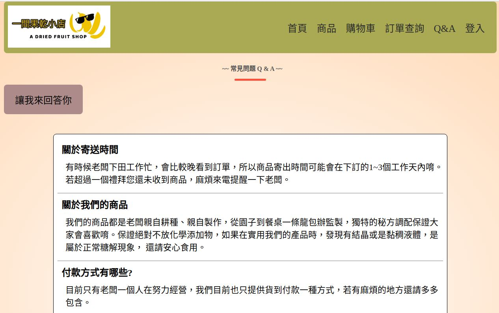

### 果乾小舖 購物網站 - 專案作品

---------------------

### Demo

-----

網址 123

### Intro

-----

##### 使用Django搭建網頁框架，網頁功能包含:

- 用戶 登入/註冊 功能
- 商品陳列/選購，購物車增、刪、改功能
- 訂單成立後訂單查詢功能
- 訂單成立後自動寄送email確認信件功能
- 靜態Q&A

##### #使用工具:

- VS code 負責編寫HTML、CSS、Javascript
- Pycharm 負責編寫Django框架與邏輯處理

##### #使用技術:

- HTML、CSS、Javascript、Django、URL API、MySQL

-----

##### #Home

- navbar: 首頁 商品 購物車 訂單查詢 Q&A 登入/登出
- 精選商品頁面、廣告業面、聯繫方式

##### #Login

- 用戶可以登入網站，查詢專屬的購物車內容

##### #Register

- 若用戶尚未註冊本網站會員可以填寫基本資料後完成註冊程序

##### #Products

- 商品列表，陳列商品供用戶選購
- 包含商品圖像、商品名稱、售價、選購按鈕

##### #Pruduct info

- 商品詳細內容頁面，提供商品詳細介紹
- 可供用戶選購商品數量
- 顯示當前購物車內商品數量，若尚未登入則不會顯示購物車內容，且點擊選購跳回登入頁面

##### #Cart

- 購物車詳細內容頁面
- 可修改購買商品數量，並計算出商品總額，亦可刪除商品
- 可選擇繼續購物、更新購物車、清空購物車、結帳等功能

##### #Customer Info Check

- 確認下單後確認收件人資訊
- 可修改收件人、電話號碼、收件地址等資訊
- 可選擇繼續購物、返回修改購物車內容、確認下單等選項

##### #確認下單後

- 系統生成訂單，並寄送確認E-mail給收件人信箱
- mail提供訂單編號以便用戶藉由訂單編號查詢訂單

##### #訂單查詢

- 用戶可憑訂單編號與e-mail信箱至本網站進行訂單細項查詢

##### #常見問題Q & A

- 較常見的問題是先列出解決方法供用戶參考

-----

